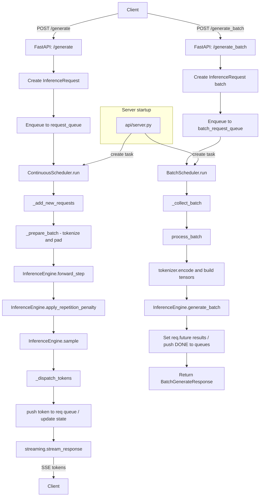

# LLM Inference Server - Technical Documentation

## Overview

This repository implements a lightweight FastAPI-based inference server for autoregressive language models using the Hugging Face `transformers` ecosystem.

The system is architected around a continuous token scheduler that batches prompt requests, reuses the model's KV cache, and streams decoded text back to the client through SSE.

Key capabilities:
- HTTP endpoint `/api/generate` for prompt-based generation
- HTTP endpoint `/api/generate_batch` for non-streaming batch generation with request timeout and cancellation support
- HTTP endpoint `/api/metrics` for runtime queue and batch metrics
- Server-sent events (SSE) token streaming using `EventSourceResponse`
- Automatic chat prompt formatting when tokenizer supports `apply_chat_template()`, with raw-prompt fallback for base models
- Central request queue and continuous scheduler for asynchronous generation
- Buffered token streaming that emits only at whitespace/punctuation boundaries or after a short buffer threshold
- Pytorch model execution with configurable temperature, top-k, top-p, and repetition penalty
- Configurable model and logging settings via YAML and `.env`

---

## Architecture Flow



> The scheduler batches active requests and uses the model's `past_key_values` cache to avoid recomputing full prompts on every step.

---

## Root Entry Point

### `main.py`

This file is the launcher used during local development.

Implementation details:
- Imports `uvicorn` and `app` from `api.server`.
- Calls `uvicorn.run("main:app", host="0.0.0.0", port=8000, workers=1, reload=True)`.
- `workers=1` is explicitly chosen for development and to avoid model loading overhead on multiple workers.
- `reload=True` enables auto-reload on source changes and should be disabled in production.

---

## API Layer

### `api/server.py`

This module constructs the FastAPI application and defines application lifecycle behavior.

Imports:
- `FastAPI` and `JSONResponse` from `fastapi`
- `asynccontextmanager` from `contextlib`
- `login` from `huggingface_hub`
- `asyncio`
- `router` from `api.routes`
- `HealthResponse` from `schemas.schemas`
- `logging_settings`, `secret_settings` from `settings.settings`
- `tokenizer_service` from `tokenizer.tokenizer_service`
- `model_loader` from `engine.model_loader`
- `ContinuousScheduler` from `scheduler.continuous_scheduler`
- `engine` from `engine.generator`
- `setup_logger` from `logger`

Lifecycle logic:
- `lifespan` is an async context manager used by FastAPI for startup and shutdown.
- On startup:
  - Log `Starting up the server...`.
  - If `secret_settings.hf_key` is defined, call `login(token=secret_settings.hf_key)` to authenticate to the Hugging Face Hub.
  - Call `tokenizer_service.load()` to instantiate the tokenizer.
  - Call `model_loader.load()` to instantiate the model and move it to the configured device.
  - Call `model_loader.warmup()` to run a single forward pass and initialize internal model caches.
  - Instantiate `ContinuousScheduler(engine, tokenizer_service)`.
  - Start the scheduler loop in the background with `asyncio.create_task(scheduler.run())`.
- On shutdown:
  - Cancel the scheduler task.
  - Await the canceled task and ignore `asyncio.CancelledError`.

App creation:
- `create_app()` builds `FastAPI(title="LLM Inference Server", version="0.1.0", lifespan=lifespan)`.
- Defines `/` root endpoint returning a JSON welcome message.
- Defines `/health` endpoint returning a `HealthResponse` model with `status: "healthy"`.
- Includes `api.routes` under prefix `/api`.
- Exposes `app = create_app()`.

Notes:
- All request and lifecycle logs are written using the configured logger.
- Startup and shutdown are tied to FastAPI’s lifespan, ensuring model and scheduler lifecycle are managed automatically.

### `api/routes.py`

This module implements the public inference endpoints.

Imports:
- `APIRouter` from `fastapi`
- `EventSourceResponse` from `sse_starlette.sse`
- `GenerateRequest`, `BatchGenerateRequest`, `BatchGenerateResponse` from `schemas.schemas`
- `InferenceRequest` from `scheduler.request`
- `stream_response` from `streaming.stream_manager`
- `request_queue`, `batch_request_queue` from `scheduler.request_queue`
- `logging_settings` from `settings.settings`
- `setup_logger` from `logger`

API behavior:
- `router = APIRouter()` registers route handlers.
- `@router.post("/generate")` takes a `GenerateRequest` body.
- Logs the prompt, `max_tokens`, and `temperature`.
- Constructs `InferenceRequest(req.prompt, req.max_tokens, req.temperature)`.
- Enqueues the request using `await request_queue.put(request)`.
- Returns `EventSourceResponse(stream_response(request))`, which exposes an asynchronous generator of decoded tokens.
- `@router.post("/generate_batch")` takes a `BatchGenerateRequest` body.
- Enqueues the batch request into `batch_request_queue` and waits for the completed batch response.
- Returns a `BatchGenerateResponse` containing text outputs for each item in the batch.
- `@router.get("/metrics")` returns runtime metrics for queue latency, batch size, and token throughput.

Low-level notes:
- The streaming endpoint does not block on actual model generation; it returns a stream handle immediately.
- The batch endpoint is designed for synchronous batch workflows and returns full text output once generation completes.
- Metrics are computed over active batch scheduler activity, with `None` values when no samples are available.
- `GenerateRequest` and `BatchGenerateRequest` validation occur before request objects are created.

---

## Model and Tokenizer

### `engine/model_loader.py`

Loads and warms up the Hugging Face language model.

Imports:
- `torch`
- `AutoModelForCausalLM` from `transformers`
- `model_settings` from `settings.settings`
- `tokenizer_service` from `tokenizer.tokenizer_service`

Class `ModelLoader`:
- `self.model` is initialized as `None`.
- `load()` checks if `self.model` is `None` and then loads the model from `model_settings.model_name`.
- The model dtype is selected based on device: `torch.float16` for `mps`, `torch.float32` otherwise.
- The model is moved to `model_settings.device` and switched to `eval()` mode to disable dropout.
- `_get_model()` lazily calls `load()` if needed and returns the model instance.

Warmup behavior:
- `warmup()` obtains the model instance.
- Encodes the text `"Warmup request"` using `tokenizer_service.encode(..., return_tensors=True)`.
- Converts the returned `input_ids` tensor to the model device.
- Runs a `torch.no_grad()` forward pass.
- Computes `torch.argmax(logits, dim=-1)` to ensure the forward path is exercised.

Global singleton:
- `model_loader = ModelLoader()`

### `tokenizer/tokenizer_service.py`

Manages tokenizer initialization, encoding, and decoding.

Imports:
- `AutoTokenizer` from `transformers`
- `model_settings` from `settings.settings`

Class `TokenizerService`:
- `self.tokenizer` is initialized as `None`.
- `load()` instantiates `AutoTokenizer.from_pretrained(model_settings.model_name)`.
- If `pad_token` is missing, sets `tokenizer.pad_token = tokenizer.eos_token`.
- Configures `tokenizer.padding_side = "left"`.

Encoding:
- `encode(text, return_tensors=False)` loads the tokenizer if needed.
- If `return_tensors=True`, returns the raw transformer output dictionary containing `input_ids` and `attention_mask`.
- Otherwise, returns a plain Python list of token IDs from the first batch element.
- Uses truncation and `max_length=model_settings.max_length` to constrain sequence length.

Decoding:
- `decode(tokens)` loads the tokenizer if needed and returns decoded text with `skip_special_tokens=True`.

Global singleton:
- `tokenizer_service = TokenizerService()`

Low-level data shapes:
- `input_ids` returned by `tokenizer(..., return_tensors='pt')` is a tensor of shape `(1, seq_len)`.
- `attention_mask` is a tensor of shape `(1, seq_len)`.

---

## Scheduler Layer

The scheduler is the core of the system and manages request multiplexing, batching, and incremental generation.

### `scheduler/request_queue.py`

A minimal wrapper around `asyncio.Queue`.

Class `RequestQueue`:
- `self.queue = asyncio.Queue()`.
- `async def put(self, request): await self.queue.put(request)`.
- `async def get(self): return await self.queue.get()`.

Global singleton:
- `request_queue = RequestQueue()`.

This queue is the handoff point between the HTTP endpoint and the scheduler loop.

### `scheduler/request.py`

Defines the in-memory request state used by the scheduler and streaming layers.

`InferenceRequest` fields:
- `prompt: str`
- `max_tokens: int`
- `temperature: float`
- `future: asyncio.Future[str]` used for external completion notification
- `queue: asyncio.Queue[int | str]` used to stream token IDs and the final `"[DONE]"` sentinel
- `input_ids: Optional[torch.Tensor]` set when the request enters the scheduler
- `attention_mask: Optional[torch.Tensor]` set when the request enters the scheduler
- `generated_tokens: list[int]` stores tokens produced so far
- `finished: bool` indicates if the request is complete
- `past: Optional[DynamicCache]` stores transformer KV cache state for incremental generation

`InferenceRequest.__init__` details:
- The constructor tries to get the current running event loop with `asyncio.get_running_loop()`.
- If no loop exists, it creates and sets a new event loop.
- Creates `self.future = loop.create_future()` for async completion semantics.
- Creates `self.queue = asyncio.Queue()` for token streaming.
- `self.past` is initialized to `None`.

`ActiveRequest` fields:
- `request: InferenceRequest`
- `original_index: int`
- `max_tokens`, `temperature` copied from the request or defaulted from `model_settings`
- `generated_tokens: list[int]`
- `finished: bool`
- `past: Optional[DynamicCache]`

`ActiveRequest` is used by `InferenceEngine.generate_batch()` for internal batched generation, preserving original request ordering.

### `scheduler/continuous_scheduler.py`

This module is responsible for continuous request consumption, dynamic batching, and incremental token generation.

Imports:
- `asyncio`, `torch`, `Any`, `Tuple`, `cast`
- `DynamicCache` from `transformers`
- `model_settings`, `logging_settings` from `settings.settings`
- `tokenizer_service` from `tokenizer.tokenizer_service`
- `request_queue` from `scheduler.request_queue`
- `InferenceRequest` from `scheduler.request`
- `setup_logger` from `logger`

`ContinuousScheduler.__init__`:
- `engine`: `InferenceEngine` instance.
- `tokenizer`: `TokenizerService` instance.
- `max_batch_size`: default 8.
- `timeout`: default 0.01 seconds.
- `active_requests: list[InferenceRequest]` starts empty.

#### `_pad_batch(tensors, padding_value)`

- Accepts a list of 2D tensors of shape `(1, seq_len)` or `(batch, seq_len)`.
- Computes `max_len = max(t.size(1) for t in tensors)`.
- Pads each tensor on the left using `torch.nn.functional.pad(t, (pad_amt, 0), value=padding_value)`.
- Concatenates the padded tensors along dimension 0.
- Returns a 2D batched tensor.

Use case:
- Initial prompt batch inputs often have varying lengths.
- Left padding is required because the tokenizer is configured with `padding_side='left'`.

#### `_add_new_requests()`

- While `len(self.active_requests) < self.max_batch_size`:
  - Calls `await asyncio.wait_for(request_queue.get(), timeout=self.timeout)`.
  - If the queue is empty for `self.timeout`, the method returns and the scheduler continues.
- For each dequeued `InferenceRequest`:
- Applies a chat prompt template if the tokenizer exposes `apply_chat_template()`, otherwise encodes the raw prompt.
- Encodes the resulting text using `self.tokenizer.tokenizer(..., return_tensors='pt')`.
- Moves `encoded['input_ids']` and `encoded['attention_mask']` to `self.engine.device`.
- Assigns `req.input_ids`, `req.attention_mask`, sets `req.past = None`, and initializes `req.seq_length` to the prompt length.
  - Appends the request to `self.active_requests`.

Low-level detail:
- The scheduler eagerly tokenizes prompts once upon request admission.
- `req.past = None` signals that the next model pass must use the full prompt instead of cached generation.

#### `_prepare_batch()`

This method converts the list of active requests into a batched model input.

Initial full prompt pass:
- If any request has `past is None`, the scheduler treats the batch as an initial encoding step.
- Collects `input_ids` and `attention_mask` across requests.
- Uses `_pad_batch()` with `pad_token_id` for `input_ids` and `0` for `attention_mask`.
- Returns `past_key_values = None`.

Subsequent incremental pass:
- If all active requests have a non-`None` `past`, the scheduler sends only the last generated token per request as `input_ids`.
- Builds a full-length attention mask for each request that covers the entire generated sequence so far, rather than only the newest token.
- Uses per-request `req.seq_length` tracking to reconstruct attention masks for KV-cached inference.
- Pads these full-length masks across the batch and concatenates them before forwarding to the model.
- Stacks request `past` caches across batch dimension using `DynamicCache(ddp_cache_data=batched_past_layers, config=self.engine.model.config)`.

Dynamic cache stacking:
- Converts each request's `DynamicCache` into a list of layers.
- For each layer, concatenates tensor entries batch-wise across request indices.
- Supports caches containing tuples of tensors and `None` placeholders.
- If any required cache element is invalid, returns `None` and the scheduler falls back to full prompt generation.

Return values:
- `input_ids`: `torch.Tensor` shaped `(batch, seq_len)`.
- `attention_mask`: `torch.Tensor` shaped `(batch, seq_len)`.
- `past_key_values`: `DynamicCache` or `None`.

#### `_dispatch_tokens(next_tokens, new_past)`

This method updates request state and pushes generated output back to clients.

Per-request behavior:
- `next_tokens` is expected to be shape `(batch, 1)`.
- For each request index `idx`:
  - Extract `token_id = next_tokens[idx].item()`.
  - If the request has `req.queue`, enqueue `token_id` with `put_nowait()`.
  - Append `token_id` to `req.generated_tokens`.
  - Construct a new token tensor `new_token = torch.tensor([[token_id]], dtype=req.input_ids.dtype, device=req.input_ids.device)`.
  - Concatenate `new_token` to `req.input_ids` on dimension 1.
  - Append `1` to `req.attention_mask` by concatenating a ones tensor.

KV cache slicing:
- If `new_past` is `None`, set `req.past = None`.
- Otherwise, validate each layer of `new_past`.
- For each request, slice out batch index `idx` from each tensor in the `DynamicCache`.
- Reconstruct `req.past` as a per-request `DynamicCache`.
- If any cache layer is invalid, fall back to `req.past = None` and future steps will regenerate using full prompts.

Completion detection:
- A request is finished when either:
  - `token_id == self.engine.eos_token_id`, or
  - `len(req.generated_tokens) >= req.max_tokens`.
- When finished:
  - Set `req.finished = True`.
  - If `req.future` is not done, set result to `tokenizer_service.decode(req.generated_tokens)`.
  - Enqueue the sentinel string `"[DONE]"` into `req.queue`.
  - Add the request to `finished_requests`.

Cleanup:
- Active requests are filtered to remove finished requests.

#### `_step()`

Coordinates a single scheduler iteration.

Sequence:
1. `batch = self._prepare_batch()`.
2. If `batch is None`, return immediately.
3. `logits, new_past = self.engine.forward_step(input_ids, attention_mask, past_key_values)`.
4. `logits = self.engine.apply_repetition_penalty(logits, input_ids)`.
5. Compute `next_tokens` with `torch.stack([...])`, sampling per request.
6. `await self._dispatch_tokens(next_tokens, new_past)`.

Important note:
- The scheduler delegates model execution and token sampling to the engine, while handling request state, queue integration, and cache management.

#### `run()`

Main scheduler loop.

Behavior:
- Forever:
  - Call `await self._add_new_requests()` to fill the batch.
  - If `self.active_requests` is empty, sleep `0.01` seconds and continue.
  - Otherwise, call `await self._step()`.
- On any exception, log the stack trace and sleep 1 second before retrying.

This loop is started once during FastAPI startup and is canceled cleanly on shutdown.

Low-level reliability notes:
- The scheduler is tolerant of empty request queues, using short sleeps instead of busy waiting.
- Error handling prevents a single exception from stopping the entire scheduler.

### `scheduler/batch_scheduler.py`

This module implements the non-streaming batch endpoint and metrics collection.

### `streaming/stream_manager.py`

This module handles SSE token decoding and controls how text deltas are emitted to the client.

Imports:
- `asyncio`
- `AsyncGenerator` from `typing`
- `InferenceRequest` from `scheduler.request`
- `tokenizer_service` from `tokenizer.tokenizer_service`
- `logging_settings` from `settings.settings`
- `setup_logger` from `logger`

Streaming behavior:
- Reads token IDs from `req.queue` until the sentinel `"[DONE]"` is received.
- Decodes the whole token sequence so far using `tokenizer_service.decode(tokens)`.
- Strips incomplete UTF-8 replacement characters from the decoded output.
- Buffers decoded text and emits updates only when a natural boundary is reached:
  - whitespace at the end of the buffered delta,
  - punctuation characters like `.,;:!?`,
  - or when the buffered delta reaches a fixed length threshold.
- Skips explicit special token IDs when the tokenizer exposes `all_special_ids`.

This reduces noisy subword chunks and produces cleaner SSE text fragments for clients.

### `scheduler/batch_scheduler.py`

Imports typically include:
- `asyncio`
- `BatchGenerateRequest`, `BatchGenerateResponse` from `schemas.schemas`
- `batch_request_queue` from `scheduler.request_queue`
- `InferenceEngine` and `tokenizer_service`
- `metrics` utilities for queue latency and throughput

Behavior:
- Consumes `BatchGenerateRequest` payloads from `batch_request_queue`.
- Builds batched tensor inputs from multiple requests and forwards them to `InferenceEngine.generate_batch()`.
- Applies request-level cancellation and timeout semantics before generation begins.
- Handles invalid `DynamicCache` states with retries or fallback to full prompt generation.
- Records metrics for queue wait time, batch size, and token throughput.

Return values:
- Produces a `BatchGenerateResponse` with one output string per batch item.
- Ensures errors are captured cleanly rather than leaking exception objects into responses.

Operational note:
- The batch scheduler runs alongside the continuous scheduler and is started during FastAPI startup.

---

## Inference Engine

### `engine/generator.py`

This module encapsulates model inference and token-selection logic.

Imports:
- `torch`
- `model_loader` from `engine.model_loader`
- `tokenizer_service` from `tokenizer.tokenizer_service`
- `model_settings`, `logging_settings` from `settings.settings`
- `setup_logger` from `logger`

`InferenceEngine.__init__()`:
- Sets `self.device = model_settings.device`.
- Sets `self._model = model_loader._get_model()`.
- `model` property returns `self._model`.

#### `sample(logits, temperature, top_k=0, top_p=1.0)`

Sampling algorithm:
- If `temperature <= 0`, selects the token with `torch.argmax(logits, dim=-1)` and returns a tensor shape `(batch, 1)`.
- Otherwise:
  - Scales logits by `1 / temperature`.
  - Top-k filtering:
    - Clips `top_k` to `[1, logits.size(-1)]`.
    - Computes the threshold using `torch.topk(logits, top_k)[0][..., -1, None]`.
    - Sets all logits below the threshold to `-inf`.
  - Top-p filtering:
    - Sorts logits descending, computes softmax probabilities.
    - Builds a cumulative distribution and removes tokens past the probability mass threshold.
    - Uses `scatter_` to mask out removed logits.
  - Samples with `torch.multinomial(probabilities, num_samples=1)`.

Return value:
- A tensor of sampled token IDs shaped `(batch, 1)`.

#### `forward_step(input_ids, attention_mask, past_key_values=None)`

Model forward pass details:
- Raises `RuntimeError` if `self.model` is `None`.
- Logs input tensor shapes for debugging.
- Calls `self.model(input_ids=input_ids, attention_mask=attention_mask, past_key_values=past_key_values, use_cache=True)`.
- Extracts `outputs.logits`.
- If logits are 3-dimensional, reduces to the last token with `logits = logits[:, -1, :]`.
- Validates the resulting logits shape is `(batch, vocab)`.
- Returns `logits.clone()` and `outputs.past_key_values`.

#### `apply_repetition_penalty(logits, input_ids, penalty=None)`

Repetition penalty algorithm:
- Uses `model_settings.repetition_penalty` when `penalty` is not provided.
- Skips processing if `penalty == 1.0`.
- Ensures logits are 2D; if 3D, takes `logits[:, -1, :]`.
- For each batch item, obtains unique tokens with `torch.unique(input_ids[i])`.
- Penalizes repeated token logits:
  - If `selected_logits < 0`, multiplies by penalty.
  - Otherwise, divides by penalty.
- Mutates `logits` in-place and returns it.

Use case:
- Helps reduce repetitive output patterns by lowering the likelihood of tokens already present in the prompt or generated output.

#### `eos_token_id` property

- Returns `self.model.config.eos_token_id`.
- Raises `RuntimeError` if the model is not loaded.

#### `generate(input_ids, max_tokens=-1, temperature=-1.0)`

Simple sequential generation path:
- Moves `input_ids` to `self.device`.
- Resolves `max_tokens` and `temperature` from settings if defaults are passed.
- In a `torch.no_grad()` context, loops up to `max_tokens` iterations:
  - Computes `outputs = self.model(input_ids)`.
  - Extracts `logits = outputs.logits[:, -1, :].clone()`.
  - Applies repetition penalty inline for each token in `input_ids`.
  - Samples `next_token`.
  - Breaks if the token equals EOS.
  - Ensures `next_token` is shape `(batch, 1)` and concatenates it to `input_ids`.
  - Yields `next_token.item()`.

#### `generate_batch(input_ids, attention_mask, requests)`

Batched generation helper:
- Accepts batched `input_ids` and `attention_mask` tensors with shapes `(batch, seq_len)`.
- Wraps each request in `ActiveRequest(request, index)`.
- Allocates `outputs = [None] * len(requests)`.
- Runs a `torch.no_grad()` loop while active requests remain.

Per-iteration behavior:
- If `past_key_values` is `None`, performs a forward pass over the full batch.
- Otherwise, performs a forward pass on `next_tokens` and supplies the cached `past_key_values`.
- Applies repetition penalty on the logits per request.
- Samples a token per active request using the request's temperature.
- Appends tokens to `r.generated_tokens` and streams them into `r.request.queue` if present.
- Marks finished requests when EOS is reached or the request reaches `max_tokens`.
- Appends new tokens to `input_ids` and attention masks to continue generation.
- Attempts to compact the active batch if requests complete.

Return behavior:
- If a request finishes, stores its decoded text into `outputs[original_index]`.
- After the loop, ensures every request has an output string.
- Sends a final `"[DONE]"` token to every request queue.

Code observation:
- The current implementation contains an indentation issue in the batch compaction block, which may prevent active batch compaction from executing as intended.

Global singleton:
- `engine = InferenceEngine()`

---

## Streaming

### `streaming/stream_manager.py`

This module converts raw token IDs into decoded strings for SSE transmission.

Imports:
- `asyncio`
- `AsyncGenerator` from `typing`
- `InferenceRequest` from `scheduler.request`
- `tokenizer_service`
- `logging_settings`
- `setup_logger`

Function `_decode_token(token_id: int) -> str`:
- Calls `tokenizer_service.decode([token_id])`.

Function `stream_response(req: InferenceRequest) -> AsyncGenerator[str, None]`:
- Loops until a sentinel `"[DONE]"` is received from `req.queue`.
- Logs each token arrival.
- Lazily loads the tokenizer if needed.
- Skips special token IDs if `tokenizer_service.tokenizer.all_special_ids` is defined.
- Decodes non-special tokens and yields the decoded string.
- Ignores empty decoded strings.
- Ends when the DONE sentinel arrives.

Low-level notes:
- Strictly speaking, the generator yields decoded text fragments, not full sentences.
- SSE consumers must reassemble received fragments if they want complete text messages.

---

## Configuration

### `settings/settings.py`

Loads runtime configuration from `settings/config.yaml` and environment variables.

Imports:
- `*` from `utils.utils`
- `BaseSettings` from `pydantic_settings`

`ModelSetting`:
- Loads YAML from `settings/config.yaml`.
- Reads `model_config.defaults`.
- Resolves the configured `device` value through `resolve_device()`:
  - `"auto"` → auto-detects the best available device: MPS (Apple Silicon) > CUDA > CPU.
  - Any explicit string (e.g. `"cpu"`, `"cuda:1"`, `"mps"`) is passed through unchanged.
- Exposes:
  - `model_name`
  - `device` (resolved)
  - `max_length`
  - `temperature`
  - `top_k`
  - `top_p`
  - `repetition_penalty`
  - `num_return_sequences`

`LoggingSetting`:
- Loads YAML from `settings/config.yaml`.
- Reads `logging_config.defaults`.
- Exposes `log_level` and `log_file`.

`SecretSetting(BaseSettings)`:
- Defines `hf_key: str | None = ""`.
- Uses `.env` by default for environment variables.

Global instances:
- `model_settings = ModelSetting()`
- `logging_settings = LoggingSetting()`
- `secret_settings = SecretSetting()`

### `settings/config.yaml`

Default configuration:
- `model_name: "openai-community/gpt2-medium"`
- `device: "auto"` — auto-detects MPS (Apple Silicon), then CUDA, then CPU
- `max_length: 20`
- `temperature: 0.5`
- `top_k: 8`
- `top_p: 0.9`
- `repetition_penalty: 1.2`
- `num_return_sequences: 1`
- `log_level: "DEBUG"`
- `log_file: "logs/app.log"`

Notes:
- The model name is easily replaceable with any compatible causal language model.
- The device field supports `"auto"`, `"cpu"`, `"cuda"`, `"cuda:1"`, or `"mps"`. Use `"auto"` to let the server pick the best available device at runtime.

---

## Schemas

### `schemas/schemas.py`

Defines request and response validation models using Pydantic.

`GenerateRequest`:
- `prompt: str` must be at least 1 character.
- `max_tokens: int | None` is optional but, when provided, must be in `[1, 2048]`.
- `temperature: float | None` is optional but must be in `[0.0, 2.0]`.

`HealthResponse`:
- `status: str`.

These schemas drive FastAPI request validation and schema generation.

---

## Logging

### `logger/logger.py`

Sets up structured logging for console and file output.

Imports:
- `logging`
- `sys`
- `Path` from `pathlib`

`setup_logger(name, level="INFO", log_file="logs/app.log")`:
- Ensures the logs directory exists: `Path(log_file).parent.mkdir(parents=True, exist_ok=True)`.
- Creates or returns a logger with the given name.
- Prevents duplicate handlers with `logger.hasHandlers()`.
- Sets log level using `getattr(logging, level.upper())`.
- Configures a formatter: `%(asctime)s | %(levelname)s | %(name)s | %(message)s`.
- Adds a `StreamHandler(sys.stdout)` and `FileHandler`.

Low-level note:
- The logger is used throughout the application for debug, info, warning, and exception tracing.

---

## Utility Helpers

### `utils/utils.py`

Provides YAML configuration loading and updating helpers.

Methods:
- `load_config(config_path)` loads YAML from disk with `yaml.safe_load`.
- `_save_config(config, config_path)` writes YAML back to disk with `yaml.dump`.
- `update_config(config_path, new_config)` merges shallow updates into the existing config and saves the file.

This utility is used by `settings/settings.py` to read the runtime configuration.

---

## Low-Level Data Flow and Types

### Request payload

A POST to `/api/generate` sends JSON like:
```json
{
  "prompt": "Hello world",
  "max_tokens": 16,
  "temperature": 0.7
}
```

### Runtime objects

- `InferenceRequest` is the primary per-call state object.
- `request_queue` is an `asyncio.Queue[InferenceRequest]`.
- `req.queue` is an `asyncio.Queue[int | str]` for token IDs and DONE signals.
- `input_ids` and `attention_mask` are `torch.Tensor` objects on the engine device.
- `past` is a `DynamicCache` instance holding model `past_key_values`.

### Tensor shapes

- `tokenizer_service.encode(..., return_tensors=True)` returns:
  - `input_ids` shape `(1, seq_len)`
  - `attention_mask` shape `(1, seq_len)`
- During batching, `_pad_batch` returns `(batch, max_seq_len)`.
- `forward_step` expects `input_ids` shape `(batch, seq_len)` and `attention_mask` shape `(batch, seq_len)`.
- After forward pass, `logits` shape is normalized to `(batch, vocab_size)`.
- `next_tokens` is produced as `(batch, 1)`.

### SSE stream values

The SSE pipeline yields decoded text fragments, not token IDs. Each event is produced by `stream_response` after decoding a token ID with `tokenizer_service.decode()`.

---

## Internal Control Flow Summary

1. `api/routes.py` receives a validated request and creates `InferenceRequest`.
2. The request is enqueued into `request_queue`.
3. `ContinuousScheduler.run()` wakes up and calls `_add_new_requests()`.
4. New requests are tokenized and appended to `active_requests`.
5. `_prepare_batch()` builds batched model inputs.
6. `InferenceEngine.forward_step()` executes the model and returns logits and new cache.
7. `apply_repetition_penalty()` modifies logits to reduce repetitions.
8. `InferenceEngine.sample()` selects a next token for each active request.
9. `_dispatch_tokens()` updates request tensors, caches, and streaming state.
10. The stream generator yields decoded fragments to the client.
11. The scheduler repeats until all active requests finish.

---

## Completed Improvements & Current Observations

Key improvements that have been implemented:
- **Request Cancellation**: Supported client-disconnect detection and request cancellation for batch generation.
- **Request Timeouts**: Supported 20-second schedule deadlines and 25-second generation timeouts.
- **Runtime Metrics**: Implemented queue latency, batch size, and token throughput tracking, exposed via the `/api/metrics` endpoint.
- **Batch Compaction Fix**: Fixed the bug in `InferenceEngine.generate_batch` where `active_requests` was not subsetted during compaction.
- **Sliding-Window Token Streaming**: Upgraded the streaming response generator to decode incrementally and strip trailing Unicode replacement characters (`\ufffd`) at token boundaries to prevent character corruption.
- **Apple Silicon (MPS) Support**: Added automatic device resolution (`"auto"` mode) that detects MPS, CUDA, or CPU at startup. Models load with `float16` on MPS to avoid memory issues. Fixed a cross-device tensor indexing bug in repetition penalty logic (`torch.unique()` returns CPU tensors on MPS, now explicitly moved to the correct device).

Future areas for improvement:
- Consider using a dedicated `IncomingRequest` object for prompt validation and sanitization.

---

## Module Reference

- `main.py`: server entrypoint and `uvicorn` launcher.
- `api/server.py`: FastAPI app creation, lifespan, scheduler startup.
- `api/routes.py`: inference endpoint and stream response wiring.
- `engine/model_loader.py`: model loading, device placement, and warmup.
- `engine/generator.py`: token sampling, forward pass, repetition penalty, batched generation.
- `tokenizer/tokenizer_service.py`: tokenizer loading, encoding, and decoding.
- `scheduler/request_queue.py`: global request queue abstraction.
- `scheduler/request.py`: request state objects and async streaming queues.
- `scheduler/continuous_scheduler.py`: dynamic batching, KV cache handling, token dispatch.
- `streaming/stream_manager.py`: SSE token decoding and generator.
- `settings/settings.py`: YAML config loader and secret settings.
- `schemas/schemas.py`: request/response validation models.
- `logger/logger.py`: logger setup and handlers.
- `utils/utils.py`: YAML config utilities.

---

## Streaming

### `streaming/stream_manager.py`

Converts raw token IDs from a request queue into decoded SSE stream payloads using a sliding-window decoder to prevent multi-byte character corruption.

Responsibilities:
- Consumes `req.queue` until the sentinel `"[DONE]"`.
- Accumulates token IDs and decodes the entire sequence to yield the new text delta.
- Strips trailing Unicode replacement characters (`\ufffd`) at token boundaries to prevent character corruption.
- Filters out special tokens when decoding.
- Skips empty decoded strings.
- Yields decoded text fragments as they become available.

Relationship with API:
- `api/routes.py` returns `EventSourceResponse(stream_response(request))`.
- The client receives each token incrementally as an SSE event.

---

## Configuration

### `settings/settings.py`

Loads runtime configuration from `settings/config.yaml`.

Settings objects:
- `ModelSetting` reads `model_config.defaults`.
- `LoggingSetting` reads `logging_config.defaults`.
- `SecretSetting` uses Pydantic `BaseSettings` to read `HF_KEY` from `.env`.

Configured values include:
- `model_name`
- `device`
- `max_length`
- `temperature`
- `top_k`
- `top_p`
- `repetition_penalty`
- `num_return_sequences`
- `log_level`
- `log_file`

### `settings/config.yaml`

Defines default runtime configuration.
- Default model: `openai-community/gpt2-medium`
- Device default: `cpu`
- Logging defaults: `DEBUG`, `logs/app.log`

---

## Schemas

### `schemas/schemas.py`

Pydantic request and response models for FastAPI.

`GenerateRequest` fields:
- `prompt: str` (required)
- `max_tokens: int | None` constrained to [1, 2048]
- `temperature: float | None` constrained to [0.0, 2.0]

`HealthResponse` fields:
- `status: str`

These schemas enable input validation and automatically-generated API docs.

---

## Logging

### `logger/logger.py`

Provides a reusable logger setup.

Implementation details:
- Creates `logs/` directory if needed.
- Configures console and file handlers.
- Uses formatter: `%(asctime)s | %(levelname)s | %(name)s | %(message)s`
- Prevents duplicate handlers by checking `logger.hasHandlers()`.

---

## Utility Helpers

### `utils/utils.py`

Contains YAML configuration helpers.

Methods:
- `load_config(config_path)` -> loads YAML from disk.
- `_save_config(config, config_path)` -> writes YAML back to disk.
- `update_config(config_path, new_config)` -> merges shallow updates into the YAML file.

Usage:
- `settings/settings.py` uses `Utils.load_config()` to obtain model and logging defaults.

---

## Request Lifecycle Summary

1. Client sends POST `/api/generate` with prompt and optional parameters.
2. API route builds `InferenceRequest` and enqueues it.
3. `ContinuousScheduler` asynchronously pulls queued requests.
4. Scheduler tokenizes prompts and adds them to `active_requests`.
5. Scheduler forms a batch and executes the model forward pass.
6. `InferenceEngine` computes logits, applies repetition penalty, and samples next tokens.
7. Scheduler dispatches tokens to each request's streaming queue.
8. `stream_manager` decodes tokens and emits them through SSE.
9. When EOS or max tokens are reached, the request completes and a `[DONE]` sentinel closes the stream.

---

## Deployment and Runtime Notes

- The app is started through `python main.py`.
- In production, remove `reload=True` and consider increasing `workers`.
- The FastAPI app is created by `create_app()` in `api/server.py`.
- The scheduler lifecycle is tied to FastAPI startup and shutdown.
- Hugging Face auth is optional; if `HF_KEY` is missing, the server uses anonymous access.

---

## Extension Points

Implemented enhancements:
- Non-streaming batch endpoint support via `/api/generate_batch`.
- Explicit request cancellation and timeout handling for batch inference.
- Metrics collection for queue latency, batch size, and token throughput.
- Retry/fallback handling for invalid `DynamicCache` states.
- Support for both SSE streaming and synchronous batch generation paths.

---

## Appendix: Key Data Structures

### `InferenceRequest`
- `prompt`: original user text
- `max_tokens`: generation budget
- `temperature`: randomness control
- `future`: completion future
- `queue`: SSE token queue
- `input_ids`, `attention_mask`: tensor state
- `generated_tokens`: output token history
- `past`: transformer cache state

### `ActiveRequest`
- Mirrors `InferenceRequest` for batch-generation bookkeeping.
- Tracks `original_index` to preserve request order.

---

## Known Behavior

- The scheduler expects token IDs and attention masks to be padded consistently for full prompt forward passes.
- Token generation is emitted as raw decoded text fragments, not full sentences.
- The `stream_response` generator filters special tokens and ignores blank decoded results.

---

## How to Read the Code per Module

- `main.py`: server launcher.
- `api/server.py`: application lifecycle and route registration.
- `api/routes.py`: inference request entry point.
- `engine/model_loader.py`: model loading and warmup.
- `engine/generator.py`: model-forward and sampling logic.
- `tokenizer/tokenizer_service.py`: tokenizer lifecycle and encode/decode wrappers.
- `scheduler/request_queue.py`: queue abstraction.
- `scheduler/request.py`: request state objects.
- `scheduler/continuous_scheduler.py`: core dynamic batching scheduler.
- `streaming/stream_manager.py`: SSE token decoding and streaming.
- `settings/settings.py`: config loader for model and logging settings.
- `schemas/schemas.py`: API validation models.
- `logger/logger.py`: logging setup helper.
- `utils/utils.py`: Config utilities.
